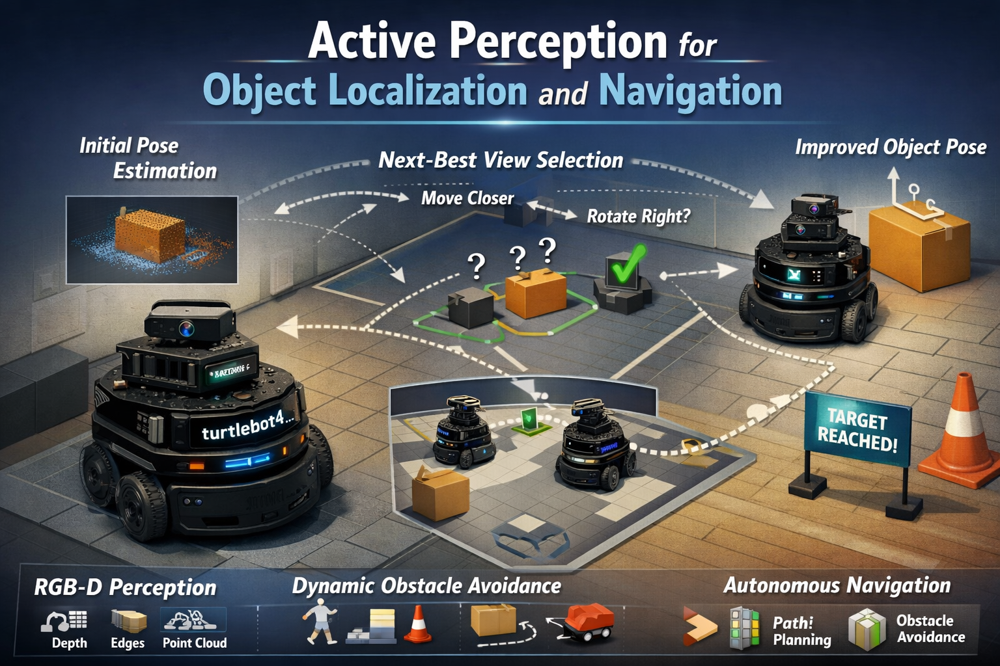

# Active Perception for Accurate Object Localization and Navigation

## Project Overview

We are building a TurtleBot4 system that can localize a target object (e.g., a box or cylinder) using RGB-D perception and then autonomously move to improve that estimate. Starting from an initial view, the robot computes an object pose estimate along with a confidence score. Based on this estimate, it selects a next-best viewpoint to reduce pose uncertainty through an active perception strategy.

This perception–action loop repeats until the pose estimate reaches a desired accuracy threshold. During this process, the robot plans and navigates to each next-best viewpoint while safely handling static and dynamic obstacles using ROS 2 navigation tools.

## Team

# Mohammad Nasr

---
- 🤖 I am currently involved in research focused on **Robot Learning**.
- 🧠🔧 My expertise spans **Robot Software Development**, **Aerial Robots**, **Dynamics & Vibration**, **Data Acquisition Systems**, **Acoustics**, **Signal Processing**, and **CAD Design**.
- 📫 How to reach me: **nasrmohammad661@gmail.com, mnasr3@asu.edu**

# Vikas Narang

---
- 🤖 I am currently involved in research focused on **Robot Learning**.
- 🧠🔧 Research Interests: Robot autonomy, mapping, motion planning , controls , data driven controls, simulation.
- 📫 How to reach me: **vikasnar@gmail.com, vnarang2@asu.edu**

### Name Lastname

- Role: Integration
- Affiliation: Arizona State University
- Research Interests: systems integration, ROS2, embedded robotics
- GitHub: https://github.com/username

## Repository Contents

- ROS2 packages for perception and navigation
- Pose estimation pipeline
- Simulation and real-robot integration
- Documentation and experiments

## Project Goals

- Accurate object localization with RGB-D: estimate the target object’s pose on the ground plane (x, y, θ) in real time.
- Active perception: choose the next robot viewpoint that improves pose accuracy using a confidence/uncertainty metric.
- Autonomous navigation: move between viewpoints and to the final approach pose without teleoperation.
- Integrate perception with robot decision-making

## Quick Links

- 📂 Repository: https://github.com/mohammadnsr1/MobileRobots_Active_Perception.git
- 📖 Documentation: docs/
- 🎥 Demo: (add later)
