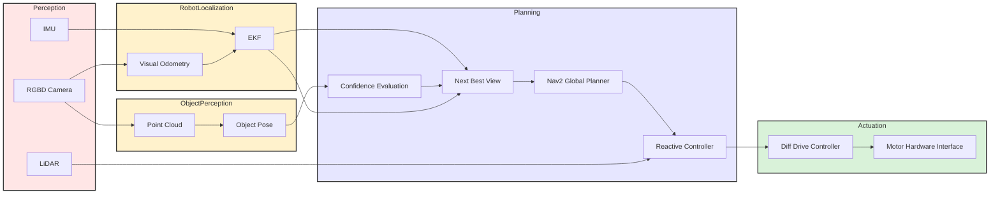

# Report 1: Active Perception for Accurate Object Localization and Navigation
{: .no_toc }

**Robot:** TurtleBot4 · **Stack:** ROS 2, Nav2, RGB-D perception, next-best-view (NBV)

---

## Table of Contents

{: .no_toc .text-delta }

1. TOC
{:toc}

---

## 1. Mission Statement & Scope

### 1.1 Mission Statement

The goal of this project is to develop an autonomous mobile robot system capable of accurately localizing a target object using RGB-D perception and actively improving this estimate through motion. The TurtleBot4 will estimate the target object's ground-plane pose relative to the robot and compute a confidence metric representing the reliability of the estimate.

Using an active perception loop, the system will determine the next-best viewpoint that is expected to reduce pose uncertainty. The robot will autonomously navigate to these viewpoints while avoiding obstacles using the ROS2 Nav2 navigation stack or a reactive controller till a desired confidence threshold is achieved.

### 1.2 Scope

| In scope | Out of scope |
| :--- | :--- |
| Localization of a single target object (e.g., box or cylinder) on the ground plane | Multi-object simultaneous tracking |
| Indoor navigation with static and dynamic obstacles | Outdoor or unstructured terrain |
| Next-best-view selection based on confidence/uncertainty | Full 6-DOF object pose or manipulation |
| Nav2 for path planning and obstacle avoidance | Developing a custom SLAM or navigation framework |

### 1.3 Success State (Measurable)

- The system will be considered successful if the following conditions are met:

- The robot can estimate the ground-plane pose of a target object using RGB-D data.

- The system can evaluate pose confidence and select a next-best viewpoint to improve localization accuracy.

- The robot autonomously navigates between viewpoints while avoiding obstacles.

- The pose estimate converges to a stable solution within a predefined confidence threshold.

### 1.4 Environment Description

- Indoor hallway/room 
- Target objects (e.g., boxes, cylinders) on the ground;
- static obstacles (furniture, walls) and optional dynamic obstacles (e.g., pedestrians).

---

## 2. Technical Specifications

### 2.1 Robot Platform

- **Platform:** TurtleBot 4.
- **Base:** Differential drive.
- **Onboard sensors:** RGB-D camera, LiDAR, IMU. 

### 2.2 Kinematic Model

- **Model:** Differential drive.
- **State:** (x, y, θ) on the ground plane; forward kinematics from wheel velocities.

### 2.3 Perception Stack

| Component | Role |
| :--- | :--- |
| RGB-D camera | Depth + color; point cloud and images | 
| LiDAR | 2D scan for Nav2 costmaps and obstacle detection, sensor fusion with camera depth data for reliable depth estimation | 
| IMU | Odometry / orientation support |

---

## 3. High-Level System Architecture

### 3.1 Data Flow Diagram (Perception → Estimation → Planning → Actuation)

  

### 3.2 Module Declaration Table

| Module / Node | Function Domain | Software Type | Description | Owner |
| :--- | :--- | :--- | :--- | :--- |
| RGBD Camera + LiDAR | Perception | Library | Provides RGB images, depth data, and LiDAR range measurements used for perception and obstacle detection. | ROS2 Driver |
| IMU | Estimation | Library | Provides inertial measurements used for robot motion estimation and fusion with visual odometry. | ROS2 Driver |
| Object Pose Estimation | Perception | Custom (Course Algorithm) | Estimates the ground-plane pose (x, y, yaw) of the target object from the segmented point cloud generated from RGB-D data. | Mohammad |
| Visual Odometry | Estimation | Library / Custom Integration | Tracks visual features between frames to estimate robot motion relative to the environment. | Vikas |
| EKF | Estimation | Library | Fuses IMU and visual odometry data to produce a filtered estimate of robot pose. | Vikas |
| Next Best View | Planning | Custom | Determines the next viewpoint that maximizes expected improvement in object pose accuracy. | Mohammad |
| Nav2 Global Planner | Planning | Library | Generates a collision-free global path from the robot’s current pose to the selected viewpoint. | Nav2 |
| Reactive Controller | Planning | Library | Performs local obstacle avoidance and trajectory tracking using LiDAR data. | Nav2 |
| Diff Drive Controller | Actuation | Library | Converts velocity commands into wheel commands for the differential drive robot. | ROS2 Control |
| Motor Hardware Interface | Actuation | Library | Interface between controller outputs and the TurtleBot4 motor hardware. | ROS2 Control |

## 4. Module Intent

### 4.1 Library Modules

**RGB-D driver (e.g., RealSense)**  
 

---

### 4.2 Custom Modules

#### 4.2.1 Active Perception

**Object pose estimation from RGB-D (ground-plane x, y, yaw)**  

**Confidence scoring / stability filtering**  

**NBV viewpoint selection policy**  

**Goal update gating / replanning trigger**  

#### 4.2.2 Visual Odometery

---

## 5. Safety & Operational Protocol

### 5.1 Deadman Switch / Timeout Logic
The system implements a deadman (command timeout) mechanism to prevent continued motion in the absence of recent control commands. Each received velocity command updates a timestamp. A periodic safety monitor checks the age of the most recent command. If the elapsed time exceeds a configured timeout threshold, the robot immediately publishes a zero-velocity command and transitions to a safe-stop state.Motion is permitted again only after fresh commands are received and the system remains healthy for a short re-enable window. This logic ensures that a stalled controller, dropped network connection, or crashed teleoperation/planning node results in a prompt, controlled stop.

### 5.2 Conditions Triggering E-Stop
An emergency stop (E-stop) condition forces an immediate zero-velocity command and places the robot in a latched safe state that requires explicit operator recovery. E-stop is triggered by any of the following:

- Manual E-stop request (hardware button if available or software E-stop command).

- Safety zone violation, defined as an obstacle detected within a minimum stopping distance in the direction of motion.

- Contact or hazard events reported by onboard safety sensors (e.g., bumper activation or cliff detection when available).

- Violation of configured motion limits (linear speed and/or angular rate exceeding allowable bounds).

### 5.3 Behavior on Sensor Dropout or Localization Failure
The system monitors both message freshness and validity/quality for sensors and state estimation. Any failure transitions the robot to SAFE_STOP (zero velocity) immediately and blocks autonomous motion until recovery criteria are met.

**Sensor dropout monitoring**
Lidar: The system monitors $$/scan$$ (sensor_msgs/msg/LaserScan). If no scan is received for $$T_{scan}$$(typical: 0.5–1.0 s), the robot commands zero velocity and enters SAFE_STOP. Autonomous motion remains disabled until /scan returns and remains healthy for a sustained window (e.g., 1–2 s of continuous messages).

Odometry: The system monitors $$/odom$$ . If odometry messages stop for $$T_{odom}$$ (typical: 0.5–1.0 s), the robot enters SAFE_STOP. This prevents operation without reliable velocity and pose integration.

**Logging and status reporting**
All safety triggers (deadman timeout, obstacle stop, sensor timeout, localization fault, manual E-stop) are logged with timestamps and the trigger source. A consolidated safety status(e.g., /safety_status) to support debugging and to provide evidence of correct safety behavior during demonstrations.

---

## 6. Git Infrastructure

### 6.1 Repository

- **GitHub Page:** https://seasonedleo.github.io/RAS_Mobile_Robotics_Vision/
- **GitHub Repository :** https://github.com/mohammadnsr1/MobileRobots_Active_Perception
---
