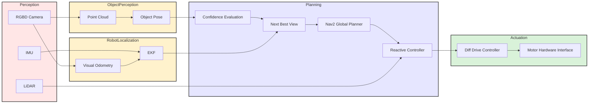

# Report 2 — Mid-Point Technical Proof
{: .no_toc }

This report documents the transition from system design to implementation for the project. It provides the formal technical structure for Milestone 2 while reserving all project-specific results, measurements, and evidence for later completion.

---

## Table of Contents

{: .no_toc .text-delta }

1. TOC
{:toc}

---

## 1. Kinematics

This section must formally describe the robot motion model using LaTeX equations, explicitly mapping control inputs to state updates.

### 1.1 Robot Motion Model

<!-- TODO: State the robot configuration variables and define the coordinate frame convention. -->
<!-- TODO: Derive the motion model appropriate for the robot base used in this project. -->

**Placeholder guidance:** Define the state vector, reference frames, and the kinematic model used for implementation.

$$
\text{TODO: Insert robot motion model equation(s), e.g., } \dot{\mathbf{x}} = f(\mathbf{x}, \mathbf{u})
$$

**Short explanation placeholder:** Briefly explain what each state variable and model term represents, and why this model is appropriate for the platform.

### 1.2 Control Inputs

<!-- TODO: Identify the commanded inputs used by the controller or middleware interface. -->
<!-- TODO: Validate that the chosen inputs match the deployed ROS 2 control interface. -->

**Placeholder guidance:** Specify the control inputs used by the robot and how they correspond to commanded motion.

$$
\text{TODO: Insert control input definition, e.g., } \mathbf{u} = [u_1, u_2]^\top
$$

**Short explanation placeholder:** Clarify whether the implementation uses linear/angular velocity, wheel velocities, or another control representation.

### 1.3 State Update Equations

<!-- TODO: Derive the discrete-time state update equations used in software. -->
<!-- TODO: Confirm the update step matches the controller or estimator execution rate. -->

**Placeholder guidance:** Show how the selected control inputs propagate the robot state over one time step.

$$
\text{TODO: Insert discrete-time update equation(s), e.g., } \mathbf{x}_{k+1} = f(\mathbf{x}_k, \mathbf{u}_k, \Delta t)
$$

**Short explanation placeholder:** Describe how the continuous or nominal model is converted into the update form used in code.

---

## 2. System Architecture

This section describes the functional modules that compose the active perception pipeline. Each module is responsible for a specific stage of object detection, pose estimation, viewpoint planning, and navigation. The system is organized as a ROS 2 network where perception nodes stream observations, decision modules operate on demand, and an orchestrator manages the active perception loop.

### 2.1 Mermaid Diagram

### 2.1.1 Data Flow Diagram (Perception → Estimation → Planning → Actuation)

### 2.1.2 rqt_graph Export

  

**Figure 2.1.** Annotated ROS 2 computational graph for the active perception pipeline. Solid black arrows denote implemented topic connections labeled as `/topic_name [msg_type]`. Dashed red arrows denote implemented service calls labeled as `/name [srv_type]`, while dashed blue arrows denote planned Nav2 action integration labeled as `/name [action_type]`. The graph illustrates the flow from perception through pose estimation and orchestration to next-best-view planning and navigation.

**Explanation:** Figure 2.1 provides a runtime view of the ROS 2 system, complementing the conceptual architecture shown in the Mermaid diagram. The figure highlights the distinction between streaming perception topics and service-based decision modules.

The perception nodes detect the target object (box or cylinder) using point cloud processing techniques introduced in class. The object pose \((x, y, \text{yaw})\) is estimated using PCA and then transformed into the `odom` frame by the pose estimator node. These pose estimates are continuously streamed and consumed by the orchestrator node.

The orchestrator aggregates a short history of pose estimates and calls the `confidence_evaluator` service to compute a confidence score and determine whether an additional viewpoint is required. If the confidence exceeds the desired threshold, the process terminates. Otherwise, the orchestrator calls the `nbv_planner` service, which computes the next best view in the `odom` frame.

The resulting goal is passed to the Nav2 stack, which plans and executes a collision-free trajectory using state feedback from visual odometry fused with an EKF. This active perception loop continues until the confidence level exceeds the predefined threshold.

Custom message and service interfaces are used to facilitate structured data exchange between modules and will be described in the following section.

### 2.2 Module Descriptions

This subsection must explain every node shown in the computational map.

### 2.2.1 Module Declaration Table

| Module Type | Nodes | Inputs and Outputs | Key Parameters | Source | Status |
| :--- | :--- | :--- | :--- | :--- | :--- |
| Perception | `cylinder_finder`, `box_finder` | **Input:** `/robot_10/oakd/points [sensor_msgs/msg/PointCloud2]`  **Output:** `/active_perception/target_cloud [sensor_msgs/msg/PointCloud2]`, `viz/detections [visualization_msgs/msg/MarkerArray]` | Segmentation thresholds, cluster size bounds, geometry-specific fitting tolerances | [`cylinder_finder.py`](https://github.com/mohammadnsr1/MobileRobots_Active_Perception/blob/main/src/active_perception/active_perception/cylinder_finder.py), [`box_finder.py`](https://github.com/mohammadnsr1/MobileRobots_Active_Perception/blob/main/src/active_perception/active_perception/box_finder.py) | Implemented |
| Estimation and localization | `pose_estimator` | **Input:** `/active_perception/target_cloud [sensor_msgs/msg/PointCloud2]`, TF  **Output:** `/active_perception/target_pose [geometry_msgs/msg/PoseStamped]`, `/active_perception/pose_estimate_sample [active_perception_interfaces/msg/PoseEstimateSample]`, centroid/axes markers | `anisotropy_threshold`, `min_points`, `base_frame`, `broadcast_tf` | [`pose_estimator.py`](https://github.com/mohammadnsr1/MobileRobots_Active_Perception/blob/main/src/active_perception/active_perception/pose_estimator.py) | Implemented |
| Planning | `confidence_evaluator` | **Input:** `/active_perception/evaluate_pose_confidence [active_perception_interfaces/srv/EvaluatePoseConfidence]`  **Output:** confidence score, stop flag, NBV flag, diagnostic metrics | `position_variance_norm`, `yaw_variance_norm`, `point_count_norm`, weighting coefficients, threshold | [`confidence_evaluator.py`](https://github.com/mohammadnsr1/MobileRobots_Active_Perception/blob/main/src/active_perception/active_perception/confidence_evaluator.py) | Implemented |
| Planning | `nbv_planner` | **Input:** `/active_perception/plan_nbv [active_perception_interfaces/srv/PlanNBV]`, TF  **Output:** next viewpoint goal in `odom`, `/active_perception/nbv_markers [visualization_msgs/msg/MarkerArray]` | `planning_frame`, `default_num_candidates`, `default_radius`, utility weights | [`nbv_planner.py`](https://github.com/mohammadnsr1/MobileRobots_Active_Perception/blob/main/src/active_perception/active_perception/nbv_planner.py) | Implemented |
| Planning / coordination | `orchestrator` | **Input:** `/active_perception/target_pose [geometry_msgs/msg/PoseStamped]`, `/active_perception/pose_estimate_sample [active_perception_interfaces/msg/PoseEstimateSample]`, `/odom [nav_msgs/msg/Odometry]`  **Output:** service calls to confidence evaluation and NBV planning; planned Nav2 goal handoff | `history_size`, `desired_confidence_threshold`, `min_history_length`, `nbv_radius`, `nbv_num_candidates` | [`orchestrator.py`](https://github.com/mohammadnsr1/MobileRobots_Active_Perception/blob/main/src/active_perception/active_perception/orchestrator.py) | Implemented, Nav2 integration pending |
| Interfaces | `PoseEstimateSample.msg`, `EvaluatePoseConfidence.srv`, `PlanNBV.srv` | Defines the message and service contracts used between estimation, confidence evaluation, and viewpoint planning | Interface schema fields | [`msg/` and `srv/`](https://github.com/mohammadnsr1/MobileRobots_Active_Perception/tree/main/src/active_perception_interfaces) | Implemented |
| Navigation | Nav2 stack | Planned consumer of selected next-best-view goal pose | Goal frame, planner/controller settings | External ROS 2 package | Pending integration |
| Actuation | TurtleBot motion stack | Planned execution of velocity commands generated downstream of Nav2 | Controller/costmap settings | External ROS 2 package | Pending integration |

### 2.2.2 Custom Node Logic Flow

### 1- cylinder_finder

**Purpose:** Detect cylindrical objects from RGB-D data and publish a segmented point cloud corresponding to the target object.  

**Inputs:** RGB-D point cloud `/robot_10/oakd/points`  

**Outputs:** Segmented object point cloud, detection flag  

**Internal logic flow:** Subscribe to point cloud → filter noise → segment cylindrical geometry → extract object cloud → publish segmentation and detection status  

**Key parameters:** `depth_range`, `segmentation_threshold`, `min_cluster_size`, `target_radius_tolerance`  

**Source file link:** [TODO: Add source file path](../path/to/cylinder_finder)  

**Status:** Implemented  

### 2- pose_estimator

**Purpose:** Compute object pose from segmented point cloud and transform it from the camera optical frame to the `odom` frame.  

**Inputs:** Segmented object point cloud, TF `camera_optical_frame → base_link → odom`  

**Outputs:** Object pose in camera frame, object pose in `odom` frame  

**Internal logic flow:** Receive cloud → compute centroid → apply PCA → estimate yaw → construct pose in camera frame → transform to `odom` → publish pose  

**Key parameters:** `pca_eigenvalue_threshold`, `minimum_point_count`, `pose_smoothing_window_size`  

**Source file link:** [../src/pose_estimator.py](../src/pose_estimator.py)  

**Status:** Implemented  

### 3- confidence_evaluator

**Purpose:** Evaluate the consistency of repeated pose estimates and compute a confidence score used to determine whether another viewpoint is required.  

**Inputs:** Service request containing a batch or window of object poses in `odom` frame  

**Outputs:** Service response containing confidence score and NBV-required flag  

**Internal logic flow:** Receive a set of recent pose estimates → compute consistency metrics over position and orientation → evaluate convergence against thresholds → compute confidence score → return confidence score and NBV decision  

**Key parameters:** `window_size`, `confidence_threshold`, `position_variance_threshold`, `orientation_variance_threshold`  

**Source file link:** [../src/confidence_evaluator.py](../src/confidence_evaluator.py)  

**Status:** Planned  

### 4- nbv_planner

**Purpose:** Generate the next best viewpoint using utility-based sampling around the estimated object pose.  

**Inputs:** Service request containing object pose in `odom`, confidence score, and robot pose in `odom`  

**Outputs:** Service response containing next goal pose in `odom`  

**Internal logic flow:** Sample candidate viewpoints around object → evaluate each candidate using utility function → select highest-utility viewpoint → convert selected candidate to goal pose in `odom` → return goal pose  

**Key parameters:** `sampling_radius`, `num_candidates`, `utility_weights`  

**Source file link:** [../src/nbv_planner.py](../src/nbv_planner.py)  

**Status:** Planned  

### 5- orchestrator

**Purpose:** Coordinate the active perception loop by collecting pose estimates, calling confidence evaluation, requesting a new viewpoint when needed, and sending navigation goals to Nav2.  

**Inputs:** Object poses from `pose_estimator`, navigation status from Nav2  

**Outputs:** Service request to `confidence_evaluator`, service request to `nbv_planner`, navigation goal to Nav2  

**Internal logic flow:** Subscribe to pose estimates from `pose_estimator` → store a fixed window of recent poses → call `confidence_evaluator` service to assess consistency and compute confidence → if confidence is above threshold and NBV flag is false, terminate loop → otherwise call `nbv_planner` service to request a new goal in `odom` → send goal to Nav2 → wait for navigation result → repeat observation and evaluation loop until convergence  

**Key parameters:** `pose_window_size`, `confidence_threshold`, `max_iterations`, `reobserve_delay`  

**Source file link:** [../src/orchestrator.py](../src/orchestrator.py)  

**Status:** Planned   

#### 2.2.3 Library Node Configuration

<!-- TODO: Document any tuned third-party nodes or launch-time parameters. -->
<!-- TODO: Include parameter values only after they have been verified in experiments. -->

**Placeholder guidance:** Document tuned parameters for library-managed components such as update frequency, inflation radius, controller frequency, costmap settings, sensor frame configuration, or filter gains.

**Short explanation placeholder:** Explain which library parameters were tuned, why they mattered, and how configuration changed relative to the Milestone 1 plan.

---

## 3. Experimental Analysis & Validation

This section validates behavior under realistic conditions and documents robustness.

### 3.1 Noise & Uncertainty Analysis

#### 3.1.1 Hardware Noise / Sensor Calibration

<!-- TODO: Summarize measured or observed hardware noise characteristics. -->
<!-- TODO: Document any calibration procedure performed before experiments. -->

- Sensor offsets: [TODO: Record observed biases, frame offsets, or calibration corrections.]
- Variance/noise profiles: [TODO: Summarize measurement variance, drift, or instability.]
- Calibration observations: [TODO: Note what improved or remained problematic after calibration.]
- Tuning changes made due to noise: [TODO: Document filtering, thresholds, or parameter updates.]

### 3.2 Run-Time Issues

**Placeholder guidance:** Document behaviors observed during implementation runs, integration tests, or milestone demonstrations.

#### 3.2.1 Failure Cases Observed

<!-- TODO: List representative failure cases encountered during testing. -->

**Short explanation placeholder:** Describe the most important failure modes observed during execution without overstating conclusions.

#### 3.2.2 Recovery / Mitigation Logic

<!-- TODO: Explain the logic used to detect, recover from, or reduce failures. -->

**Short explanation placeholder:** Summarize the implemented safeguards, fallback behavior, or operator interventions used during testing.

#### 3.2.3 Remaining Limitations

<!-- TODO: Document current limitations that remain unresolved at Milestone 2. -->

**Short explanation placeholder:** Identify the known technical gaps that still affect robustness, performance, or completeness.

### 3.3 Milestone Video

**Placeholder guidance:** Add one or more embedded or directly linked YouTube/Vimeo videos showing a core sub-task or milestone-relevant technical capability.

- Video 1: [embed/link here]
- Video 2: [embed/link here]

<!-- TODO: Ensure each video clearly demonstrates a core sub-task required for Milestone 2. -->

---

## 4. Project Management

This section documents feedback integration and individual contributions.

### 4.1 Instructor Feedback Integration

<!-- TODO: Copy each Milestone 1 feedback item or question into this table and map it to an action. -->

| Milestone 1 Feedback / Question | Action Taken | Technical Change Implemented | Current Status |
| :--- | :--- | :--- | :--- |
| Change "Just the Docs Template" Webpage Title. | Updated the `_config.yaml` file | None | resolved |
| The sentence "The system will be considered successful if the following conditions are met:" should not have a bullet point. | Removed the bullet point | None | resolved |
| Khaled's name | Removed placeholders | None | in progress |

### 4.2 Individual Contribution

<!-- TODO: Insert direct links to commits, pull requests, and authored files where possible. -->

| Team Member | Primary Technical Role | Key Git Commits / PRs | Specific File(s) Authorship | Notes |
| :--- | :--- | :--- | :--- | :--- |
| `Mohammad Nasr` | `Perception_Module` | `[commit/PR link]` | `cylinder finder, box_finder, pose_estimator,orchestrator,nbv_planner,confidence_evaluator` | `all nodes need to be tested on real data/robot` |
| `[Name]` | `[TODO: role]` | `[commit/PR link]` | `[file paths]` | `[TODO: notes]` |

---

## 5. Conclusion / Current Status

This closing section should summarize current implementation progress and clearly identify what remains before the final milestone.

### 5.1 What Is Working

<!-- TODO: Summarize the subsystems that are currently functional and demonstrated. -->

**Short explanation placeholder:** Briefly state which components are operational as of this milestone checkpoint.

### 5.2 What Is Still Pending

<!-- TODO: List the highest-priority incomplete items that remain before Milestone 3. -->

**Short explanation placeholder:** Identify the major unfinished items, validation gaps, or integrations still in progress.

### 5.3 Next Steps Toward Milestone 3

<!-- TODO: Convert remaining technical work into concrete next steps for the final milestone. -->

**Short explanation placeholder:** Outline the immediate engineering priorities, validation work, and deliverables leading into Milestone 3.
