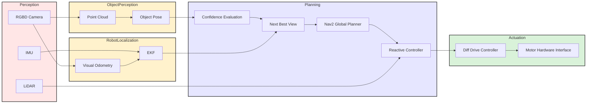

# Report 2 — Mid-Point Technical Proof
{: .no_toc }

This report documents the transition from system design to implementation for the project. It provides the formal technical structure for Milestone 2 while reserving all project-specific results, measurements, and evidence for later completion.

---

## Table of Contents

{: .no_toc .text-delta }

1. TOC
{:toc}

---

## 1. Kinematics

This section must formally describe the robot motion model using LaTeX equations, explicitly mapping control inputs to state updates.

### 1.1 Robot Motion Model

<!-- TODO: State the robot configuration variables and define the coordinate frame convention. -->
<!-- TODO: Derive the motion model appropriate for the robot base used in this project. -->

**Placeholder guidance:** Define the state vector, reference frames, and the kinematic model used for implementation.

The robot state is represented in the odometry frame (`odom`) with the state vector:

$$
\mathbf{x} = \begin{bmatrix} x \\ y \\ \theta \end{bmatrix}
$$

where $(x, y)$ is the robot's position in the global frame and $\theta$ is its orientation (yaw angle). The continuous-time differential drive kinematics are:

$$
\begin{aligned}
\dot{x} &= v \cos(\theta) \\
\dot{y} &= v \sin(\theta) \\
\dot{\theta} &= \omega
\end{aligned}
$$

The state variables represent the robot's 2D pose in the planning frame. The model is appropriate for a differential drive platform, where forward motion is coupled with rotation through the control inputs.

### 1.2 Control Inputs

<!-- TODO: Identify the commanded inputs used by the controller or middleware interface. -->
<!-- TODO: Validate that the chosen inputs match the deployed ROS 2 control interface. -->

Specify the control inputs used by the robot and how they correspond to commanded motion.

$$
\mathbf{u} = \begin{bmatrix} v \\ \omega \end{bmatrix}
$$

where $v$ is the commanded linear velocity (m/s) and $\omega$ is the commanded angular velocity (rad/s).

The implementation uses linear and angular velocity commands via the ROS 2 geometry_msgs/Twist interface streamed to the differential drive controller.

### 1.3 State Update Equations

<!-- TODO: Derive the discrete-time state update equations used in software. -->
<!-- TODO: Confirm the update step matches the controller or estimator execution rate. -->

**Placeholder guidance:** Show how the selected control inputs propagate the robot state over one time step.

The discrete-time state updates using first-order Euler integration with time step $\Delta t$ are:

$$
\begin{aligned}
x_{k+1} &= x_k + v_k \cos(\theta_k) \Delta t \\
y_{k+1} &= y_k + v_k \sin(\theta_k) \Delta t \\
\theta_{k+1} &= \theta_k + \omega_k \Delta t
\end{aligned}
$$

The discrete updates are derived from Euler integration of the continuous kinematics model. The time step $\Delta t$ corresponds to the control execution rate of the differential drive controller and the EKF fusion update.

---

## 2. System Architecture

This section describes the functional modules that compose the active perception pipeline. Each module is responsible for a specific stage of object detection, pose estimation, viewpoint planning, and navigation. The system is organized as a ROS 2 network where perception nodes stream observations, decision modules operate on demand, and an orchestrator manages the active perception loop.

### 2.1 Mermaid Diagram

### 2.1.1 Data Flow Diagram (Perception → Estimation → Planning → Actuation)

### 2.1.2 rqt_graph Export

  

**Figure 2.1.** Annotated ROS 2 computational graph for the active perception pipeline. Solid black arrows denote implemented topic connections labeled as `/topic_name [msg_type]`. Dashed red arrows denote implemented service calls labeled as `/name [srv_type]`, while dashed blue arrows denote planned Nav2 action integration labeled as `/name [action_type]`. The graph illustrates the flow from perception through pose estimation and orchestration to next-best-view planning and navigation.

**Explanation:** Figure 2.1 provides a runtime view of the ROS 2 system, complementing the conceptual architecture shown in the Mermaid diagram. The figure highlights the distinction between streaming perception topics and service-based decision modules.

The perception nodes detect the target object (box or cylinder) using point cloud processing techniques introduced in class. The object pose \((x, y, \text{yaw})\) is estimated using PCA and then transformed into the `odom` frame by the pose estimator node. These pose estimates are continuously streamed and consumed by the orchestrator node.

The orchestrator aggregates a short history of pose estimates and calls the `confidence_evaluator` service to compute a confidence score and determine whether an additional viewpoint is required. If the confidence exceeds the desired threshold, the process terminates. Otherwise, the orchestrator calls the `nbv_planner` service, which computes the next best view in the `odom` frame.

The resulting goal is passed to the Nav2 stack, which plans and executes a collision-free trajectory using state feedback from visual odometry fused with an EKF. This active perception loop continues until the confidence level exceeds the predefined threshold.

Custom message and service interfaces are used to facilitate structured data exchange between modules and will be described in the following section.

### 2.2 Module Descriptions

This section provides a detailed explanation on Modules and their logic.

### 2.2.1 Module Declaration Table

| Module Type | Nodes | Inputs and Outputs | Key Parameters | Source | Status |
| :--- | :--- | :--- | :--- | :--- | :--- |
| Perception | `cylinder_finder`, `box_finder`, `pose_estimator` | **Input:** `/oakd/points [sensor_msgs/msg/PointCloud2]`, `/active_perception/target_cloud [sensor_msgs/msg/PointCloud2]`, `/tf`, `/tf_static`  **Output:** `/active_perception/target_cloud [sensor_msgs/msg/PointCloud2]`, `/active_perception/target_pose [geometry_msgs/msg/PoseStamped]`, `/active_perception/pose_estimate_sample [active_perception_interfaces/msg/PoseEstimateSample]`, `viz/detections [visualization_msgs/msg/MarkerArray]`, target markers | Segmentation thresholds, clustering limits, fitting tolerances, `target_frame`, PCA anisotropy threshold, minimum point count | [`cylinder_finder.py`](https://github.com/mohammadnsr1/MobileRobots_Active_Perception/blob/main/src/active_perception/active_perception/cylinder_finder.py), [`box_finder.py`](https://github.com/mohammadnsr1/MobileRobots_Active_Perception/blob/main/src/active_perception/active_perception/box_finder.py), [`pose_estimator.py`](https://github.com/mohammadnsr1/MobileRobots_Active_Perception/blob/main/src/active_perception/active_perception/pose_estimator.py) | Implemented |
| Estimation and localization | `Visual Odometry`, `EKF` | **Input:** [TBD]  **Output:** `/odom [nav_msgs/msg/Odometry]` | [TBD] | [TBD] | In progress |
| Planning | `confidence_evaluator` | **Input:** `/active_perception/evaluate_pose_confidence [active_perception_interfaces/srv/EvaluatePoseConfidence]`  **Output:** confidence score, stop flag, NBV flag, diagnostic metrics | Stability weights, variance normalization terms, confidence threshold, recency weighting | [`confidence_evaluator.py`](https://github.com/mohammadnsr1/MobileRobots_Active_Perception/blob/main/src/active_perception/active_perception/confidence_evaluator.py) | Implemented |
| Planning | `nbv_planner` | **Input:** `/active_perception/plan_nbv [active_perception_interfaces/srv/PlanNBV]`, `/tf`  **Output:** next best view in `odom`, `/active_perception/nbv_markers [visualization_msgs/msg/MarkerArray]` | `planning_frame`, candidate count, radius bounds, utility weights | [`nbv_planner.py`](https://github.com/mohammadnsr1/MobileRobots_Active_Perception/blob/main/src/active_perception/active_perception/nbv_planner.py) | Implemented |
| Planning / coordination | `orchestrator` | **Input:** `/active_perception/target_pose [geometry_msgs/msg/PoseStamped]`, `/active_perception/pose_estimate_sample [active_perception_interfaces/msg/PoseEstimateSample]`, `/odom [nav_msgs/msg/Odometry]`  **Output:** service calls to confidence evaluation and NBV planning, planned Nav2 goal handoff | `history_size`, desired confidence threshold, minimum history length, NBV radius and candidate settings | [`orchestrator.py`](https://github.com/mohammadnsr1/MobileRobots_Active_Perception/blob/main/src/active_perception/active_perception/orchestrator.py) | Implemented, Nav2 integration pending |
| Custom interfaces | `PoseEstimateSample.msg`, `EvaluatePoseConfidence.srv`, `PlanNBV.srv` | Defines the message and service contracts between perception, orchestration, confidence evaluation, and NBV planning | Interface field definitions | [`active_perception_interfaces`](https://github.com/mohammadnsr1/MobileRobots_Active_Perception/tree/main/src/active_perception_interfaces) | Implemented |
| Navigation | `Nav2 stack` | **Input:** planned next-best-view goal in `odom`  **Output:** planned robot motion / action execution | Goal frame, planner settings, controller settings | External ROS 2 package | Pending integration |

### 2.2.2 Custom Node Logic Flow

The active perception system is organized as a staged ROS 2 pipeline in which perception nodes stream observations continuously, while confidence evaluation and next-best-view selection are triggered on demand by the orchestrator. This separation keeps high-rate sensing and lower-rate decision making decoupled, which simplifies both debugging and future integration with navigation.

### cylinder_finder

The `cylinder_finder` node performs geometry-specific perception for cylindrical targets. Starting from the incoming RGB-D point cloud, the node applies workspace filtering, downsampling, floor removal, local clustering, and cylinder fitting. Candidate clusters are evaluated using geometric consistency and inlier support, after which the strongest detection is selected and published as `/active_perception/target_cloud`.

Within the complete system, this node acts as a front-end detector for one object class. Its purpose is not to estimate the final object pose directly, but rather to isolate a reliable target point cloud that can be passed to the pose estimation stage. This design allows the finder to remain object-specific while the downstream pose estimator remains reusable across multiple target types.

### box_finder

The `box_finder` node plays the same architectural role as the cylinder_finder, but is specialized for box-shaped objects. It processes the incoming point cloud through spatial filtering, floor segmentation, and Euclidean clustering to isolate candidate object clusters. For each cluster, it then applies a PCA-based oriented bounding box fitting method: the cluster covariance is analyzed to extract principal axes, one axis is constrained to align with the expected vertical direction, and the cluster is projected into this local frame to estimate box center, orientation, and dimensions. Simple geometric checks on size and aspect ratios are then used to reject implausible candidates. The selected target cluster is published to the shared topic /`active_perception/target_cloud`.

### pose_estimator

The `pose_estimator` node receives the segmented target cloud and converts it into a compact pose representation suitable for planning. The incoming point cloud is first transformed from the camera optical frame into the planning frame, `odom`, using TF. Pose estimation is then performed in that common frame by computing the object centroid and using PCA to infer a stable planar orientation.

The node publishes both `/active_perception/target_pose` and `/active_perception/pose_estimate_sample`. The first provides a direct pose output for downstream consumers, while the second packages additional metadata such as point count, anisotropy ratio, and yaw source. These extra fields are important because the downstream confidence evaluator reasons not only over pose values, but also over the quality and consistency of each estimate.

### confidence_evaluator

The `confidence_evaluator` node is implemented as a service rather than a streaming subscriber. This is a deliberate design choice: confidence should be evaluated only after the orchestrator has accumulated a short history of recent pose estimates.The `confidence_evaluator` node assesses whether the current object pose estimate is reliable enough to terminate the active perception loop. Rather than evaluating a single estimate, it scores a recent history of PoseEstimateSample observations using weighted measures of positional stability, yaw stability, average point count, anisotropy of the observed cloud, and the fraction of estimates whose yaw was derived from PCA rather than fallback centroid bearing. The resulting confidence score is compared against a user-defined threshold and minimum history length to determine whether the system should stop or continue planning a next-best view.

### nbv_planner

The `nbv_planner` selects the next-best-view using a **discrete candidate evaluation strategy**. Given the current target pose and robot pose in the planning frame, it samples \(N\) candidate viewpoints uniformly on a circle around the object:

$$
\begin{aligned}
\phi_i &= \phi_0 + \frac{2\pi i}{N}, \\
x_i &= x_t + r \cos(\phi_i), \\
y_i &= y_t + r \sin(\phi_i),
\end{aligned}
$$

with each candidate yaw chosen to face the target:

$$
\theta_i = \operatorname{atan2}(y_t - y_i,\; x_t - x_i).
$$

Each candidate is scored using the weighted cost

$$
J^{(i)} = w_r C_r^{(i)} + w_d C_d^{(i)} + w_h C_h^{(i)},
$$

where

$$
\begin{aligned}
C_r^{(i)} &= \frac{|r - r_d|}{\max(r_d,\varepsilon)}, \\
C_d^{(i)} &= \frac{\|\mathbf{p}_i - \mathbf{p}_r\|}{\max(r_{\max},\varepsilon)}, \\
C_h^{(i)} &= \frac{|\operatorname{wrap}(\theta_i - \theta_r)|}{\pi}.
\end{aligned}
$$

The selected next-best-view is the sampled candidate with minimum cost:

$$
i^* = \arg\min_i J^{(i)}.
$$

Therefore, the planner does not solve a continuous optimization problem; it samples a finite set of candidate viewpoints, scores them, and returns the lowest-cost one.

### orchestrator

The `orchestrator` is the coordination layer for the active perception loop. It subscribes to the streaming pose outputs from the pose estimator and stores a bounded history of recent pose samples. with at least one sample, it calls the `confidence_evaluator` service. If confidence is sufficiently high, the loop terminates. Otherwise, it calls the `nbv_planner` service to request a new goal in `odom`.

In detail, the orchestrator uses a state-machine approach, and defines the following states: IDLE, WAITING_FOR_POSE, EVALUATING, PLANNING_NBV, READY_TO_NAVIGATE, DONE. Each new sample is appended to this history and, provided the system is not already evaluating or planning, triggers a confidence-evaluation service request. The request contains the full current history window along with the desired confidence threshold and minimum history length. If the returned confidence response indicates that estimation is sufficiently reliable, the orchestrator transitions to a terminal DONE state. Otherwise, it constructs and sends a next-best-view planning request using the latest target pose and robot pose. The NBV response is then stored as the next candidate navigation goal, and the orchestrator transitions to a READY_TO_NAVIGATE state. In the current implementation, the actual Nav2 call is marked as a TODO, so the orchestration logic ends at NBV selection rather than full closed-loop execution.

### custom interfaces

Custom ROS2 interfaces are used to encapsulate system-specific data and decision structures that are not represented by standard message types. In particular, the `PoseEstimateSample` message extends a basic pose representation with additional quality metrics such as point count, anisotropy ratio, and yaw estimation source, enabling downstream modules to reason about estimation reliability. Similarly, the `EvaluatePoseConfidence` and `PlanNBV` services define clear request–response interfaces for decision-making components.

#### PoseEstimateSample.msg

| Field | Type |
|------|------|
| header | std_msgs/Header |
| pose | geometry_msgs/Pose |
| point_count | int32 |
| anisotropy_ratio | float32 |
| yaw_source | string |

---

#### EvaluatePoseConfidence.srv

**Request**

| Field | Type |
|------|------|
| history | PoseEstimateSample[] |
| desired_confidence_threshold | float32 |
| min_history_length | int32 |

**Response**

| Field | Type |
|------|------|
| success | bool |
| confidence_score | float32 |
| position_variance | float32 |
| yaw_variance | float32 |
| mean_point_count | float32 |
| mean_anisotropy_ratio | float32 |
| should_stop | bool |
| should_plan_nbv | bool |
| diagnostic_message | string |

---

#### PlanNBV.srv

**Request**

| Field | Type |
|------|------|
| target_pose | geometry_msgs/PoseStamped |
| robot_pose | geometry_msgs/PoseStamped |
| num_candidates | int32 |
| radius | float32 |
| min_radius | float32 |
| max_radius | float32 |
| use_adaptive_radius | bool |

**Response**

| Field | Type |
|------|------|
| success | bool |
| selected_index | int32 |
| candidate_views | geometry_msgs/PoseArray |
| best_view | geometry_msgs/PoseStamped |
| diagnostic_message | string |

### 2.2.3 Library Node Configuration

The primary library-based component in this system is the Nav2 stack, which will be used to execute navigation toward the next-best-view goals generated by the planning module. At the current stage, Nav2 is not yet fully integrated into the active perception loop, and therefore no parameter tuning has been finalized.

In the final system, Nav2 will receive goal poses in the `odom` frame from the orchestrator and will be responsible for global path planning, local obstacle avoidance, and velocity command generation. Its configuration will include standard parameters such as costmap settings, planner and controller plugins, inflation radius, and update frequencies.

Since the current milestone focuses on perception and decision-making, Nav2 is treated as a downstream module, and its detailed configuration will be completed and validated in the next milestone once full system integration is achieved.

---

## 3. Experimental Analysis & Validation

This section validates behavior under realistic conditions and documents robustness.

### 3.1 Noise & Uncertainty Analysis

#### 3.1.1 Hardware Noise / Sensor Calibration

<!-- TODO: Summarize measured or observed hardware noise characteristics. -->
<!-- TODO: Document any calibration procedure performed before experiments. -->

- Sensor offsets: [TODO: Record observed biases, frame offsets, or calibration corrections.]
- Variance/noise profiles: [TODO: Summarize measurement variance, drift, or instability.]
- Calibration observations: [TODO: Note what improved or remained problematic after calibration.]
- Tuning changes made due to noise: [TODO: Document filtering, thresholds, or parameter updates.]

### 3.2 Run-Time Issues

**Placeholder guidance:** Document behaviors observed during implementation runs, integration tests, or milestone demonstrations.

#### 3.2.1 Failure Cases Observed

<!-- TODO: List representative failure cases encountered during testing. -->

**Short explanation placeholder:** Describe the most important failure modes observed during execution without overstating conclusions.

#### 3.2.2 Recovery / Mitigation Logic

<!-- TODO: Explain the logic used to detect, recover from, or reduce failures. -->

**Short explanation placeholder:** Summarize the implemented safeguards, fallback behavior, or operator interventions used during testing.

#### 3.2.3 Remaining Limitations

<!-- TODO: Document current limitations that remain unresolved at Milestone 2. -->

**Short explanation placeholder:** Identify the known technical gaps that still affect robustness, performance, or completeness.

### 3.3 Milestone Video

**Placeholder guidance:** Add one or more embedded or directly linked YouTube/Vimeo videos showing a core sub-task or milestone-relevant technical capability.

- Video 1: [embed/link here]
- Video 2: [embed/link here]

<!-- TODO: Ensure each video clearly demonstrates a core sub-task required for Milestone 2. -->

---

## 4. Project Management

This section documents feedback integration and individual contributions.

### 4.1 Instructor Feedback Integration

<!-- TODO: Copy each Milestone 1 feedback item or question into this table and map it to an action. -->

| Milestone 1 Feedback / Question | Action Taken | Technical Change Implemented | Current Status |
| :--- | :--- | :--- | :--- |
| Change "Just the Docs Template" Webpage Title. | Updated the `_config.yaml` file | None | resolved |
| The sentence "The system will be considered successful if the following conditions are met:" should not have a bullet point. | Removed the bullet point | None | resolved |
| Khaled's name | Removed placeholders | None | in progress |

### 4.2 Individual Contribution

<!-- TODO: Insert direct links to commits, pull requests, and authored files where possible. -->

| Team Member | Primary Technical Role | Key Git Commits / PRs | Specific File(s) Authorship | Notes |
| :--- | :--- | :--- | :--- | :--- |
| `Mohammad Nasr` | `Perception_Module` | `[970c915,b180cfd, 4a9a162, 03b2bf6 (For report)]` | `cylinder finder, box_finder, pose_estimator,orchestrator,nbv_planner,confidence_evaluator` | `all nodes need to be tested on real data/robot` |
| `[Name]` | `[TODO: role]` | `[commit/PR link]` | `[file paths]` | `[TODO: notes]` |

---
