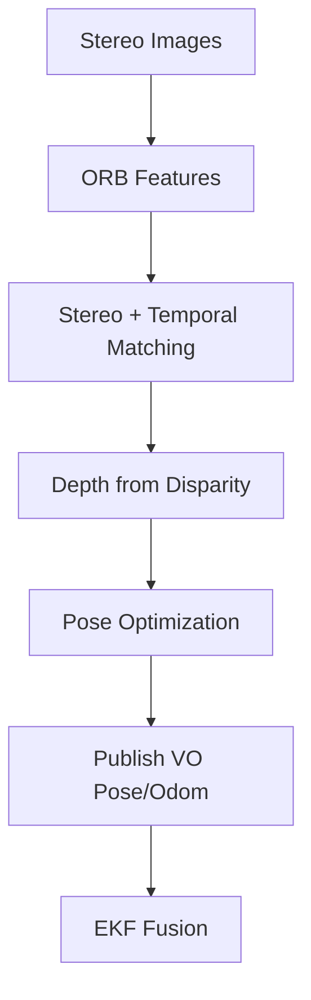

# Report 3 — Final Documentation & Analysis

{: .no_toc }

---

## Table of Contents

{: .no_toc .text-delta }

1. TOC
{:toc}

---

## 1. Graphical Abstract

<!-- Required by Milestone 3: include a single visual summary for the course gallery. -->
<!-- TODO: Replace this placeholder with the final graphical abstract image and caption. -->

  

**Figure 1.1.** Graphical abstract summarizing the project mission, core perception-and-planning pipeline, and final mission outcome.

### 1.1 Project Mission

This project addresses the problem of localizing a target object using a mobile robot in an indoor environment without relying on a pre-built map. The robot observes the scene with onboard vision sensors, estimates the object pose in its local odometry frame, and evaluates whether that estimate is reliable enough for use. When confidence is low, the robot autonomously moves to a better nearby viewpoint and repeats the estimation process. The mission objective is to achieve more reliable object localization through closed-loop active perception rather than a single static observation

---

## 2. Algorithm

This section presents the algorithmic design rationale and execution logic of the custom modules and ROS 2 nodes used in the system. Although Report 2 outlined the main components and their core functions, this section examines them in greater detail, with emphasis on internal data flow, decision-making logic, and the way the modules interact to support active perception.

### 2.1 System Components and Their Interactions

### 2.1.1 Perception Module 

The perception module structure and node-level connectivity were introduced in Report 2. In this report, the emphasis is on the final implementation logic and on the role of perception within the active perception loop. The module consists of the object-specific detection nodes (`cylinder_finder.py` and `box_finder.py`) together with the downstream `pose_estimator.py` node, which converts segmented target observations into pose estimates in the planning frame (`odom`).

Both detection nodes follow a common preprocessing pipeline based on spatial filtering, voxel downsampling, and floor removal. After that, each node applies object-specific reasoning. The final box finder differs from the earlier design outlined in Report 2. Rather than relying on a PCA-only interpretation of the segmented object, the implemented node first filters candidate points using a brown color model appropriate for cardboard-like box surfaces, then forms Euclidean clusters, and finally fits an upright oriented box by analyzing the horizontal footprint and vertical extent of each candidate cluster. Geometric constraints on dimensions and support size are used to reject implausible hypotheses, and the best valid cluster is selected as the box target. This change was introduced to make the final box detection stage more object-specific, since the earlier PCA-only approach did not provide sufficiently reliable detection performance

The segmented target cloud is then passed to the pose estimator, which computes the target centroid and dominant horizontal orientation, transforms the estimate into the `odom` frame, and publishes both the final pose and a pose-estimate sample for downstream confidence evaluation. In this way, the perception module provides the geometric target information required by the rest of the active perception system.

### 2.1.2 Planning Module

The planning module structure and its node-level role within the active perception loop were already described in Report 2. In the final system, the implementation logic of this module remained largely unchanged, with the confidence evaluator using a simplified four-term scoring scheme. The module consists of `confidence_evaluator.py` and `nbv_planner.py`, which together determine whether the current target estimate is sufficiently reliable or whether an additional viewpoint should be planned.

The `confidence_evaluator.py` node receives a recent history of pose-estimate samples and computes a confidence score from four quantities: positional variance, yaw variance, mean point count, and mean anisotropy ratio. These terms are combined into a single score that determines whether the robot should stop or continue the active perception process.

If the confidence threshold is not reached, the `nbv_planner.py` node generates candidate viewpoints around the current target estimate in the planning frame and scores them according to radius error, travel distance, and heading change. The best candidate is returned as the next-best-view goal, while marker outputs are published for visualization in RViz.

Together, these two nodes provide the decision-making layer that closes the active perception loop by determining whether the current estimate is sufficient or whether a new observation pose is required.

### 2.1.3 Visual Odometry or Estimation & Localization Module, ORB-SLAM3 + EKF

This section documents the localization module contribution based on ORB-SLAM3 stereo visual odometry integrated with EKF fusion.

#### Camera Used in ORB-SLAM Pipeline

The ORB-SLAM3 node uses the TurtleBot4 OAK-D stereo camera pair as its primary localization sensor:

- Left camera image topic: `/oakd/left/image_raw`
- Right camera image topic: `/oakd/right/image_raw`
- Left camera calibration topic: `/oakd/left/camera_info`
- Right camera calibration topic: `/oakd/right/camera_info`

Stereo intrinsics and baseline are consumed through calibration/configuration parameters (`fx`, `fy`, `cx`, `cy`, image size, and baseline term such as `Camera.bf`) so that feature correspondences can be triangulated at metric scale.

#### How ORB-SLAM3 Works in This Project

ORB-SLAM3 estimates the camera pose by repeatedly solving a geometric consistency problem between image observations and a 3D map.

The Mermaid pipeline above can be explained as: ORB-SLAM3 computes a camera trajectory from stereo images, and this project publishes that trajectory as VO odometry/path.

<!-- ##### What I Actually Used From ORB-SLAM3 -->

In `orb_vo_node.py`, each synchronized stereo pair is sent to:

$$
\mathbf{T}_{cw}^{(k)} = \texttt{TrackStereo}(I_L^k, I_R^k, t_k),
$$

where `T_cw^(k)` is the camera pose returned by the backend at frame `k`. The node first inverts it to get camera pose in the ORB reference frame:

Then this trajectory is aligned to `odom` (startup anchoring) before publishing:
$$
\mathbf{T}_{odom,c}^{(k)} = \mathbf{T}_{cw}\,\mathbf{T}_{orb,c}^{(k)}
$$

Both `orb` and `odom` are local startup-referenced frames (no global map frame is used).  
The aligned local pose is transformed into robot planar motion and published as `/orb_slam/vo_odom`, while the full history is appended to `/orb_slam/vo_path`.

##### Block A: Stereo Images

Input at frame `k`: rectified stereo pair `(I_L^k, I_R^k)`. Rectification enforces epipolar alignment:

$$
v_L \approx v_R.
$$

Fundamentally, this means a match for a left pixel is searched along one row (the `u`-axis), not over a full 2D area.

Simple rectification math (step-by-step):

1. Start with raw left/right pixels and remove lens distortion using calibration:
$$
x_u = \text{undistort}(x_d; K, D)
$$

2. Rotate both camera views into a common virtual stereo frame:
$$
x'_{L}=R_L x_{uL},\qquad x'_{R}=R_R x_{uR}
$$

3. Reproject with rectified camera models:
$$
\tilde{u}_L=P_L X,\qquad \tilde{u}_R=P_R X
$$

4. Choose `(R_L, R_R, P_L, P_R)` so corresponding points land on the same row:
$$
v_L \approx v_R
$$

5. Then disparity is horizontal only:
$$
d = u_L-u_R,\qquad Z=\frac{f_x b}{d}
$$

Parameter meaning:
- `u, v`: pixel column and row
- `K`: camera intrinsics `(f_x, f_y, c_x, c_y)`
- `D`: distortion coefficients
- `R_L, R_R`: rectification rotations
- `P_L, P_R`: rectified projection matrices
- `b`: stereo baseline
- `d`: disparity

Calibration source in this implementation:
- Monocular calibration for each camera (left and right) comes from each `CameraInfo` message (`K`, `D`, `R`, `P` fields).
- Stereo calibration (left-to-right relationship) is also taken from the paired `CameraInfo` messages, including baseline from the projection matrices.
- In this project, these are read from `/robot_10/oakd/left/camera_info` and `/robot_10/oakd/right/camera_info`.

##### Block B: ORB Features

ORB feature extraction in this project does four things:

1. Build a multi-scale image pyramid (so features are found at different sizes):
$$
I^{(\ell)}(x,y)=I(x/s^\ell,\;y/s^\ell),\quad \ell=0,\dots,L-1
$$
where `s` is `ORBextractor.scaleFactor` and `L` is `ORBextractor.nLevels`.
Here, `x` is the horizontal pixel coordinate (column), `y` is the vertical pixel coordinate (row), and `ell` is the pyramid level index.

2. Detect FAST corners (good trackable points) at each level.
FAST tests intensity change around each candidate pixel `p`. A pixel is marked as a corner if enough contiguous pixels on a small circle are much brighter or darker than the center:
$$
I(q)\ge I(p)+t \quad \text{or} \quad I(q)\le I(p)-t
$$
where `t` is the FAST threshold (`ORBextractor.iniThFAST`, with fallback `ORBextractor.minThFAST` in low-texture regions).

3. Assign an orientation to each keypoint:
$$
\theta=\operatorname{atan2}(m_{01},m_{10})
$$
Here, `theta` is the keypoint orientation angle, `m10` is the first-order intensity moment along the horizontal direction, and `m01` is the first-order intensity moment along the vertical direction in the local keypoint patch.
This gives a dominant local direction, so the same point can still match after camera rotation.

4. Build a binary descriptor by comparing pairs of pixel intensities in the oriented patch:
$$
b_m=
\begin{cases}
1,& I(\mathbf{p}+\mathbf{a}_m)<I(\mathbf{p}+\mathbf{b}_m)\\
0,& \text{otherwise}
\end{cases}
$$
Parameter meaning in this test:
- `p`: keypoint center pixel location in the current image level.
- `I(.)`: image intensity function (pixel brightness value at a location).
- `a_m, b_m`: predefined offset vectors for comparison pair `m`, rotated by the keypoint orientation.
- `b_m`: output bit of comparison `m` (`1` if the first sampled pixel is darker, else `0`).
- `M`: total number of binary comparisons used to form one descriptor.
All bits are stacked into one descriptor vector `d` with binary entries (`0/1`) and length `M`.

Final output per feature is:
$$
(u,v,\theta,\mathbf{d})
$$
which means pixel location, orientation, and binary signature used for matching.

##### Block C: Stereo + Temporal Matching

Flow from Block B: each feature now has `(u, v, theta, d)` where `d` is a binary descriptor.

This block matches those descriptors in two ways:
1. Left-right at same time `k` (stereo match) -> needed for disparity/depth.
2. Frame `k-1` to frame `k` (temporal match) -> needed for motion tracking.

Descriptor similarity is measured by Hamming distance:
$$
d_H(\mathbf{d}_i,\mathbf{d}_j)=\sum_m \mathbf{1}[d_{i,m}\oplus d_{j,m}]
$$

For each feature, ORB picks the best match with minimum distance:
$$
j^*=\arg\min_j d_H(\mathbf{d}_i,\mathbf{d}_j)
$$

Then geometric checks reject bad matches (for stereo, row consistency after rectification; for temporal, motion consistency).  
Small Hamming distance + geometric consistency means likely same physical 3D point.

##### Block D: Depth from Disparity

From stereo matches in Block C, disparity is:
$$
d=u_L-u_R
$$

Depth is then computed by:
$$
Z=\frac{f_x b}{d}
$$

Back-projection to 3D camera coordinates:
$$
X=\frac{(u-c_x)Z}{f_x},\qquad Y=\frac{(v-c_y)Z}{f_y}
$$

So Block C gives valid stereo correspondences, and Block D converts them to metric 3D points.

##### Block E: Pose Optimization

Now combine:
- 3D points from Block D
- 2D observations in the current image

The camera pose `T_k` is estimated by minimizing reprojection error:

$$
\mathbf{T}_k^*=\arg\min_{\mathbf{T}_k}\sum_i
\rho\!\left\|
\mathbf{u}_{i,k}-\pi(\mathbf{K}\mathbf{T}_k\mathbf{X}_i)
\right\|^2.
$$

Interpretation in simple terms:
1. Guess a pose.
2. Project each 3D point into the image.
3. Measure pixel error to where it was actually observed.
4. Update pose to reduce total error.

This is the core VO step that produces the camera trajectory.

##### Block F: Publish VO Pose/Odom

After ORB-SLAM3 returns pose, the node aligns trajectory origin to wheel odometry at startup and publishes:

- `/orb_slam/vo_odom` (current pose)
- `/orb_slam/vo_path` (trajectory history)

If \((x_o,y_o,\psi_o)\) is startup odom and \((\Delta x,\Delta y)\) is relative VO displacement, planar alignment is:

$$
\begin{bmatrix}
x\\y
\end{bmatrix}
=
\begin{bmatrix}
x_o\\y_o
\end{bmatrix}
+
\begin{bmatrix}
\cos\psi_o & -\sin\psi_o\\
\sin\psi_o & \cos\psi_o
\end{bmatrix}
\begin{bmatrix}
\Delta x\\\Delta y
\end{bmatrix}.
$$

This converts relative VO displacement into the `odom` frame used by the robot stack.

##### Block G: EKF Fusion

EKF fusion is optional integration stage for smoother localization. In this project report, VO path generation is produced directly by ORB-SLAM3 output; EKF is the downstream fusion layer when enabled. EKF sensor fusion was implemented but not calibrated . Final fused path  is the average of VO and odom.

#### ORB-SLAM3 Features and Parameters Used

The ORB-SLAM3 configuration relies on the standard ORB feature extractor and stereo parameters:

- `ORBextractor.nFeatures`: target number of features extracted per frame.
- `ORBextractor.scaleFactor`: image pyramid scaling between levels.
- `ORBextractor.nLevels`: number of pyramid levels for multi-scale matching.
- `ORBextractor.iniThFAST`: initial FAST threshold for keypoint detection.
- `ORBextractor.minThFAST`: fallback FAST threshold in low-texture regions.
- `Camera.fps`: expected image frame rate for timing consistency.
- `ThDepth`/stereo depth threshold terms: constrain valid stereo depth range.

Practically, these parameters control the accuracy/robustness trade-off: higher feature counts and tuned FAST thresholds improve tracking in texture-limited indoor scenes but increase compute load.

### 2.1.4 Navigation, Control, Actuation Module

The navigation and actuation role of the system was initially intended to be handled through Nav2, as discussed in Report 2. In the final implementation, however, Nav2 was replaced by a lightweight local controller implemented in `odom_controller.py`. This change was made because the final system operates without a global map and expresses all perception and planning outputs directly in the `odom` frame. Since Nav2 typically assumes a map-based navigation setup, it was not well aligned with the final local active perception pipeline.

An alternative attempt was made to use SLAM Toolbox in order to provide the mapping layer required for Nav2, but this integration was not brought to a stable operational state during the project. For this reason, the final system adopted a simpler local-control formulation that directly drives the TurtleBot4 to a goal pose in the `odom` frame.

The `odom_controller.py` node subscribes to an `odom`-frame navigation goal and the robot odometry feedback, then publishes velocity commands to drive the robot toward the requested viewpoint. The controller uses proportional control for linear motion and PD control for heading correction, with bounded linear and angular velocities, a rotate-in-place mode for large heading errors, and separate tolerances for final position and yaw convergence. In this way, the module provides the final execution link between the viewpoint selected by the planner and the physical robot motion required to acquire the next observation.

### 2.1.5 Orchestrator

The orchestrator structure was already introduced in Report 2, and its core role remained unchanged in the final system. Its main responsibility is to connect the perception, planning, and motion-execution modules into a closed-loop active perception process. In the final implementation, this role was extended to include the local navigation executor: once a next-best-view pose is selected, the orchestrator publishes the corresponding `odom`-frame goal and waits for the navigation status before resuming perception.

Operationally, the orchestrator stores a bounded history of pose-estimate samples, waits until a minimum history length is available, calls the confidence-evaluation service, and either terminates the active perception loop or requests a next-best-view from the planner. If a new viewpoint is required, the selected goal is sent to the local controller, and the orchestrator returns to the observation state after navigation completes successfully. This makes the orchestrator the supervisory logic that manages state transitions between observation, evaluation, replanning, and motion execution.

Let the robot pose in the planning frame be

$$
\mathbf{x}_k =
\begin{bmatrix}
x_k \\
y_k \\
\theta_k
\end{bmatrix},
$$

and let the target pose estimate at step \(k\) be

$$
\hat{\mathbf{o}}_k =
\begin{bmatrix}
\hat{x}_k \\
\hat{y}_k \\
\hat{\psi}_k
\end{bmatrix}.
$$

Let the recent history of pose-estimate samples be

$$
\mathcal{H}_k = \{s_1, \dots, s_N\},
$$

where each sample contains a pose estimate, the number of points in the segmented target cloud, and the anisotropy ratio returned by the pose-estimation stage. Over this history window, the confidence evaluator computes the position variance, the yaw variance, the mean point count, and the mean anisotropy ratio.

$$
\sigma_p^2 = \frac{1}{N}\sum_{i=1}^{N}
\left\|
\begin{bmatrix}
x_i \\
y_i
\end{bmatrix}
-
\begin{bmatrix}
\bar{x} \\
\bar{y}
\end{bmatrix}
\right\|^2,
$$

$$
\sigma_\psi^2 = \frac{1}{N}\sum_{i=1}^{N}
\operatorname{wrap}(\psi_i-\bar{\psi})^2,
$$

$$
\bar{n} = \frac{1}{N}\sum_{i=1}^{N} n_i,
\qquad
\bar{a} = \frac{1}{N}\sum_{i=1}^{N} a_i.
$$

Here, \(n_i\) denotes the point count of the \(i\)-th pose-estimate sample, and \(a_i\) denotes its anisotropy ratio. Therefore, \(\bar{n}\) is the mean point count over the history window, and \(\bar{a}\) is the mean anisotropy ratio over the same window.

These quantities are converted into bounded component scores:

$$
S_p = \frac{1}{1+\sigma_p^2/\eta_p}, \qquad \eta_p = 0.005,
$$

$$
S_\psi = \frac{1}{1+\sigma_\psi^2/\eta_\psi}, \qquad \eta_\psi = 0.08,
$$

$$
S_n = \operatorname{clip}\left(\frac{\bar{n}}{\eta_n}, 0, 1\right),
\qquad \eta_n = 200,
$$

$$
S_a = \operatorname{clip}\left(\frac{\bar{a}}{\eta_a}, 0, 1\right),
\qquad \eta_a = 0.5.
$$

The final confidence score is

$$
C_k = w_p S_p + w_\psi S_\psi + w_n S_n + w_a S_a,
$$

where the current implementation uses

$$
w_p = 0.3,\qquad
w_\psi = 0.2,\qquad
w_n = 0.1,\qquad
w_a = 0.15.
$$

The orchestrator stops active perception if

$$
N \geq N_{\min}
\quad \text{and} \quad
C_k \geq \tau,
$$

otherwise it requests a next-best-view.

$$
N_{\min} = 10
$$

in the current implementation.

For next-best-view planning, let the candidate viewpoint set be

$$
\mathcal{V} = \{v_i\}_{i=1}^{M},
$$

where each \(v_i\) is a candidate robot observation pose generated around the current target estimate. Each candidate is then scored by

$$
J(v_i)=
\alpha \frac{|r_i-r_d|}{r_d}
+
\beta \frac{d_i}{r_{\max}}
+
\gamma \frac{|\operatorname{wrap}(\theta_i-\theta_k)|}{\pi},
$$

In this cost function, \(r_i\) denotes the candidate radius from the target, \(r_d\) denotes the desired observation radius, \(d_i\) denotes the robot travel distance from its current pose to the candidate, and \(\theta_i\) denotes the candidate viewing yaw. The term \(\theta_k\) denotes the robot’s current yaw in the planning frame. The planner then selects

$$
v_k^\star = \arg\min_{v_i \in \mathcal{V}_{\text{valid}}} J(v_i),
$$

after rejecting candidates whose travel distance is below a minimum threshold. The current implementation uses

$$
\alpha = 0.2,\qquad \beta = 0.1,\qquad \gamma = 0.2.
$$

When radius randomization is enabled, each candidate radius is sampled in the interval \([r_{\min}, r_{\max}]\); otherwise a fixed or adaptive base radius is used.

## 3. Benchmarking & Results

This section must present empirical evidence from the final mission and evaluate how well the system performed, even if the final demonstration was only partially successful.

### 3.1 Experimental Setup

<!-- TODO: Describe hardware, software version, environment, trial conditions, and what counts as success. -->

Document the robot configuration, sensing stack, environment conditions, object type(s), and any reset procedure used between trials.

<!-- TODO: Milestone 3 expects reliability data across at least 10 trials. -->

| Trial | Mission Outcome | Detection Success | Pose Quality | NBV / Navigation Success | Notes |
| :--- | :--- | :--- | :--- | :--- | :--- |
| 1 | `TODO` | `TODO` | `TODO` | `TODO` | `TODO` |
| 2 | `TODO` | `TODO` | `TODO` | `TODO` | `TODO` |
| 3 | `TODO` | `TODO` | `TODO` | `TODO` | `TODO` |
| 4 | `TODO` | `TODO` | `TODO` | `TODO` | `TODO` |
| 5 | `TODO` | `TODO` | `TODO` | `TODO` | `TODO` |
| 6 | `TODO` | `TODO` | `TODO` | `TODO` | `TODO` |
| 7 | `TODO` | `TODO` | `TODO` | `TODO` | `TODO` |
| 8 | `TODO` | `TODO` | `TODO` | `TODO` | `TODO` |
| 9 | `TODO` | `TODO` | `TODO` | `TODO` | `TODO` |
| 10 | `TODO` | `TODO` | `TODO` | `TODO` | `TODO` |

### 3.5 Discussion of Results

The ROS bag trajectory comparison between visual odometry (VO) and wheel odometry (`/odom`) shows that both estimates follow the same global motion pattern, including the initial straight segment, left-turn rise, and large loop return. This indicates that the stereo ORB-SLAM3 pipeline is tracking motion consistently at the shape level.

  

**Figure 3.5.** VO (`/orb_slam/vo_path`, blue) vs wheel odometry (`/odom`, green) trajectory comparison from ROS bag playback.

Observed behavior from the plot:
- The early path segment overlaps closely, confirming good startup alignment between the two estimates.
- During the looped section, VO and odometry diverge gradually, which is expected from accumulated drift and different sensor error characteristics.
- VO captures the overall loop geometry with similar trend but shows larger deviation near the far-right and lower-loop portions.

Interpretation:
- The localization module meets the core objective of producing a stable, metric VO trajectory from stereo camera data.
- The remaining gap between VO and wheel odometry indicates that calibration/timing quality and fusion tuning are still the main bottlenecks for final accuracy.
- This result is consistent with earlier findings in Report 2: stereo synchronization quality and long-horizon drift behavior dominate localization error.

---

## 4. Ethical Impact Statement

<!-- Milestone 3 requests roughly 300 words covering privacy, safety, and bias. -->

This project combines perception, localization, and autonomous motion (`odom`-frame local navigation) to improve object pose estimation through active viewpoint selection. Because the robot uses RGB-D sensing and moves near people/obstacles, ethical analysis is required at both micro-ethics (engineering decisions in implementation) and macro-ethics (system effects on users and bystanders).

### 4.1 Ethics Scorecard (Formal Tests)

| Test | Status | Reasoning (Cite Part 1 Definitions) |
| :--- | :--- | :--- |
| **Utilitarian Test** | **Pass (Conditional)** | The active-perception loop improves mission success (better object localization) and reduces repeated manual intervention, which creates clear operational benefit. However, benefit depends on safe execution and sensor reliability; if localization degrades, utility drops quickly. |
| **Justice Test** | **Partial / Needs Improvement** | The system does not intentionally classify people by sensitive attributes, but fairness is not yet formally audited across lighting, texture, object material, and occlusion conditions. Uneven error rates across environments can create unequal burden (e.g., poorer performance in cluttered or reflective scenes). |
| **Virtue Test** | **Pass (Conditional)** | The implementation shows responsible engineering intent: explicit safety monitoring, conservative goal execution, and transparent module traceability. Remaining virtue gap: incomplete quantitative safety/fairness validation before claiming production readiness. |

### 4.2 Privacy

The robot consumes camera streams and point clouds that can incidentally capture people in indoor environments. In the current pipeline, data is primarily used for online processing (feature extraction, stereo matching, VO/path estimation) rather than identity analytics. No face recognition or person re-identification is implemented. Ethical risk remains if raw recordings are stored or shared without policy controls. Recommended practice is data minimization: store only what is needed for debugging, limit retention duration, and remove personal imagery from public artifacts.

### 4.3 Safety

The dominant ethical risk is physical harm from autonomous motion. This project addresses safety through bounded local control, `odom`-frame goal execution, and stop-oriented behavior when sensing/localization quality is poor. Safety intent is consistent with the project scope in Reports 1 and 2: avoid unsafe continuation under stale or unreliable state estimates. Residual risk remains in edge cases such as dynamic obstacles, abrupt VO degradation, and timing mismatch between sensing and actuation. Therefore, conservative velocity bounds and robust stop conditions are ethically required, not optional.

### 4.4 Bias and Technical Limitations

Perception quality depends strongly on texture, illumination, synchronization quality, and geometric visibility. ORB-based VO and stereo depth can underperform in low-texture scenes, glare, blur, and partial occlusion. This is a technical bias source: performance is not uniform across all operating contexts. If unreported, this can create misleading trust in autonomy. Ethical reporting therefore requires explicit disclosure of known failure modes and quantitative error ranges.

### 4.5 Ethical Framework Interpretation and Engineering Fixes

From a utilitarian view, the system is justified when total safety and task benefit exceed deployment risk. From a justice view, fairness requires validation across diverse scenes and operating conditions, not only nominal runs. From a virtue view, engineers should prioritize transparent limitations and fail-safe behavior over optimistic claims.

Immediate engineering fixes:
1. Add a formal pre-deployment checklist with localization confidence and sensor-freshness gates before motion authorization.
2. Add fairness-style robustness tests across at least multiple lighting/texture/object conditions and report per-condition failure rates.
3. Add strict data-handling policy for camera recordings (retention limit and anonymization for shared media).

---

## 5. Custom Module Code Links

Every custom module discussed in this report must include a direct repository hyperlink to the relevant source file and, where possible, the exact line range implementing the logic.

| Module | Role in System | Direct Link |
| :--- | :--- | :--- |
| `cylinder_finder.py` | Cylinder detection from point clouds | `TODO` |
| `box_finder.py` | Box detection from point clouds | `TODO` |
| `pose_estimator.py` | Pose estimation in the planning frame | `TODO` |
| `confidence_evaluator.py` | Confidence scoring service | `TODO` |
| `nbv_planner.py` | Next-best-view planning | `TODO` |
| `orchestrator.py` | Active perception coordination | `TODO` |
| `orb_vo.yaml` | localization config | `https://github.com/mohammadnsr1/MobileRobots_Active_Perception/tree/main/src/ORB_EKF/config/orb_vo.yaml` |
| `orb_vo_node.py` | Visual odometry integration | `https://github.com/mohammadnsr1/MobileRobots_Active_Perception/tree/main/src/ORB_EKF/orb_ekf/orb_vo_node.py` |
| `ekf.yaml` / localization config | Sensor fusion configuration | `https://github.com/mohammadnsr1/MobileRobots_Active_Perception/tree/main/src/ORB_EKF/config/ekf.yaml` |

> Note: Replace each `TODO` entry with a clickable GitHub URL to the exact file and line number used in your implementation.
{: .note }

---

## 6. Individual Contribution & Audit Appendix

This appendix should make authorship auditable and match the Milestone 3 requirement for individual technical accountability.

| Team Member | Primary Technical Role | Key Git Commits / PRs | Specific File(s) Authorship |
| :--- | :--- | :--- | :--- |
| Mohammad Nasr | `Perception & Planning Module` | `970c915, b180cfd, 4a9a162, 03b2bf6` | `cylinder_finder.py, box_finder.py, pose_estimator.py, confidence_evaluator.py, nbv_planner.py, orchestrator.py, odom_controller.py` |
| Vikas Narang | `Localization_Module (VO + EKF)` | `1 parent 3b519bc, 61fc196 (report contribution), ORB_EKF commits` | `src/ORB_EKF/orb_ekf/orb_vo_node.py, src/ORB_EKF/config/orb_vo.yaml, src/ORB_EKF/config/ekf.yaml` |
| Khaled | `Navigation_Module` | `e5e9469` | `navigation subsystem design and Nav2 integration artifacts` |
